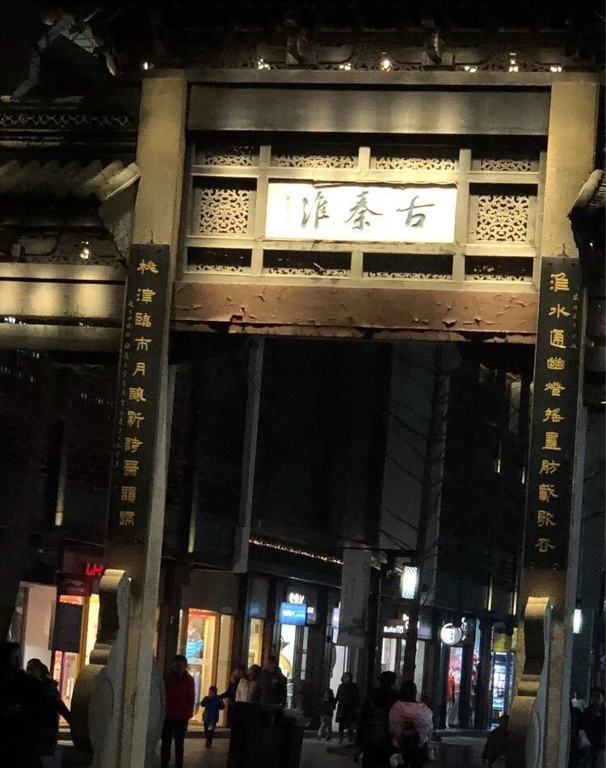

丁酉岁末，携夫人夜游秦淮。秦淮流韵，萦绕心头，不吐不快，余特作文以记之。

注：

1. 文源、文德、武定、朱雀为秦淮河上的桥梁名称。建业、建康、集庆、金陵、天京为南京城不同时期的称谓。
2. 皓月中分，听导游说，秦淮河的白鹭洲中分秦淮河，在月明星稀的晚上，只见白鹭洲两边的水面上倒映着圆圆的 月亮。
3. 长桥，秦淮河上的长桥，与青楼相关，在历史上士大夫通过长桥与青楼名妓相会。
4. 雕龙，为南朝南梁刘勰所作的《文心雕龙》。
5. 寄奴，南朝刘宋开国之君，名刘裕，小名寄奴，曾收复洛阳、长安两都，被誉为南朝第一帝。
6. 黄公，即黄观，明初安徽贵池人。其在乡试、会试、殿试中均考第一，为明洪武二十四年状元。
7. 八艳，指明末清初秦淮河畔的八大名妓，顾横波、董小宛、卞玉京、李香君、寇白门、马湘兰、柳如是、陈圆圆。
8. 媚香，指秦淮河畔媚香楼。
9. 右军，指草圣王羲之，官至右军，故称王右军。根据导游所言，献之幼时恣意张狂。一天写得“大”字，呈现父亲，以待褒奖。羲之未予评价，添加一点成“太”字。献之转呈母亲，欲与其父论高下。其母聪慧，轻声呢喃：“我儿习得三江水，只有一点像羲之。”献之顿悟，刻苦练习，终成草王。
10. 虫二，意指风月无边。
11. 虺，小龙。

陈敦教授：第一次见李老师用这样的字词写景，有点意外，但又在情理之中。李老师不仅在法学领域有深入而独到的思考，更是关注史学、哲学、文学、经济学等关系国计民生之学问，因此写出这样的作品也就在情理之中了。记得李老师常说，法学既在法学之中，又在法学之外，正是其理。细读秦淮咏唱，还是能够感受到法学教授的写作风格的。此文第一段写秦淮河之由来，第二段写秦淮河之景物，第三段写有关政治史，第四段写文华史，最后一段总结千年之历史，发空灵飘逸之感慨。全篇架构清晰，逻辑严密，语言优美，句句含典，事事有评，体现了法学教授对于历史文化政治之情怀，还原法学教授经天纬地、架构社会、体味生活之本来应有之面貌！

文艺评论家谢海峰：1 月 4 日，我独处西子湖畔，与秦淮隔山可远望，西子静谧而秦淮喧嚣，然吾对西子苦思良久，终不得文字，喝尽咖啡，扫兴而去。却不想彼时，有李姓师长仁玉兄见河如见史，见秦淮如见诗，引古如流，据典若历，发乎情，行于字，心有丘壑，胸怀远大，若骈似赋，含诗蕴词，有魏晋遗风，有唐宋风韵。读罢愧叹，恨不能把臂同游，八芳竟艳，一品千古风流，幸见文字，如唔亲临，待来日方长，煮酒秦淮，再论英雄！

张树松：情思翻涌，文采飞扬，章法严谨，辞美音谐，转合自然，一韵到底。数千年往事注入笔端，可谓鸿篇巨制！

