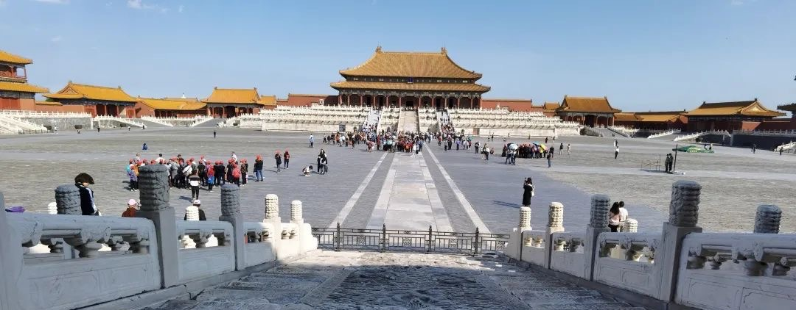

故宫历经六世，为明清两代的皇城，又称紫禁城。自成祖朱棣迁都北京，大明共历 14 帝，其间皇城几度火灾被毁，几度重建。明末闯王李自成进京，称帝百日，兵败将皇城付之一炬，几近焚毁。满清从奉天迁都北京，共历十帝，皇城得以修复。虽曾多次遭受火灾，但得以不断重建和扩建。辛亥革命后清帝退位，直到 1925 年废帝搬离皇宫，紫金城变成故宫博物院，百姓才得以参观。人民共和国成立后的七十年里，故宫得以不断修复。故宫是世上现存的规模最大的木质结构建筑群，是按照《周礼.考工纪》天人合一的设计理念建设，以中轴线延伸，自然对称，左祖右社，南朝后市。现故宫共有房屋 9 千多间，重重殿宇金碧辉煌。因疫情，故宫也曾闭馆，疫情得控，故宫重新开放。2020 年 9 月 22 日，我和夫人因参观苏轼展来到故宫，参观了故宫的主要殿宇，心中感慨，特填词记之。

郭纹静教授点评：故宫行吟是一部恢宏伟大的史诗。金碧辉煌的建筑群无与伦比，皇权至上被展现的淋漓尽致，第三段将其身世变迁浓缩为不足百字，甚妙！最喜最后的犀利评判，几千年来围绕皇权多少亲情断！感谢伟大的时代，平民百姓得以进皇园！

吴志攀教授点评：大曲之序，犹如作赋，仁玉兄大词逻辑严谨，语句准确，是好词。故宫行吟一调。

诗人张树松点评：首阙点明时间，写进入故宫初见之游人和景物。二阙纪行，概写从太和殿到后宫的掠影。三阙写明清两代故宫历史。尾阙议论，起拍点出主题。继而争帝位三字，带出皇家血缘、姻缘、君臣关系的种种惨象。非稔熟历史、思想深邃者不能为之。结拍由专制转入共和，色彩顿觉明亮，所谓豹尾是也。莺啼序为长调之最，非才大力巨者不能为之。莺调之难，要在气脉之贯通与运转，方得生动。作者一气贯之，气力不加，而意思层层深入，由物到人再到制度，最后以共和为结，可谓势大力沉，才厚思深，堪称作手。本词亦为莺啼序之难得佳作！
